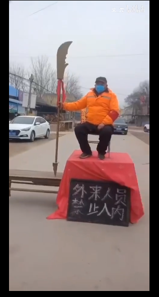

## 肺炎大作战

### 概述

玩家控制村口大爷，手持关公大刀，阻止一切疫情有关的活动

### 控制方式

wasd 控制上下左右移动，按下 J 键后挥出砍刀

### 游戏玩法

地图周围四周比较大，需要大爷不断巡逻

* 出现人群聚集的地方，超过5个人就要用大刀攻击，驱散人群禁止集会
* 有人想 出去打麻将、出门聚会逛街、在家里憋得慌、手痒了想去网吧、去KTV唱歌 要把他“砍回家”
* 不戴口罩出门的一定要“砍”回去

最终游戏会统计一天内阻止了多少件危险事情发生，给予不同的评价

### 大爷操控部分

* 移动操控
* 挥砍大刀从而把想要出村子的人赶回家里
* 挥砍大刀从而把村子里聚集的人打散
* 大爷头上会有文字气泡，显示他此时说的话
* 对不同的事件进行交互会说不同的话，具体见下方对话文档

### 村民部分

* 村民必须要表现的非常贱贱的，必须远高于现实，勾起玩家“砍人”的欲望
* 想要出去的村民
  * 村民会从家门口出来，停个2秒钟说一段话，说哪些具体看下方对话文档
  * 随后，村民自动寻路去村门口，头上的气泡保持开启状态
  * 被“砍”到后，气泡会改成其他的话，并回家，具体见下方对话文档
* 在城里聚堆的村民
  * 多个村民会从家门口出来，停个2秒钟说一段话，说哪些具体看下方对话文档
  * 随后，村民自动到聚堆点周围，头上的气泡保持开启状态
  * 到达聚堆点后，头顶的气泡会随机变换文字，
  * 玩家需要“砍”向聚堆的人群聚集处
  * 被“砍”后，会离开并回家

### 打开广播

大爷在村门口中间电线杆上打开广播后，第一遍广播是正常的，再次触发打开会出现“真”广播，随后触发游戏开始

### 文字对话文档

* 大爷的语录
  * 隔离你
  * 你就待不住
  * 聚堆儿，聚堆儿，好聚堆儿（打到聚集群众时）
  * 刀都架到脖子上了，只怕自己死的慢

* 村民的语录
  * 管他是冠状饼状，我就是要出来晃荡
  * 过年不打麻将，手痒的不行
  * 到舞厅蹦迪去喽
  * 出去k歌，我就是饶舌郭富城！
  * 左边跟我一起画个龙，跟我右边画一道彩虹，走起
  * 足球是我心，我心是足球
  * 外面街道空空，出去拍照采风~
  * 去山里打点“野味”
* 村民被“砍“语录
  * 动漫不好看吗，为什么要出门
  * 游戏不好玩吗，为什么要出门
  * 开心斗地主，网上一样乐
  * 育碧just dance不香吗
  * 不如待在家里玩”健身环大冒险“
  * 刺激战场，等我来战，回家
  * 不敢了，不敢了
  * 溜了溜了
  * VR设备玩着香，世界各处任我浪
* 聚堆人群
  * 一群人就是要整整齐齐
  * 不聚堆儿，不过年
  * 我给你们表演个绝活
  * 出来透气真是舒适
  * 抽根烟冷静一下
  * 不要过于”恐慌“

